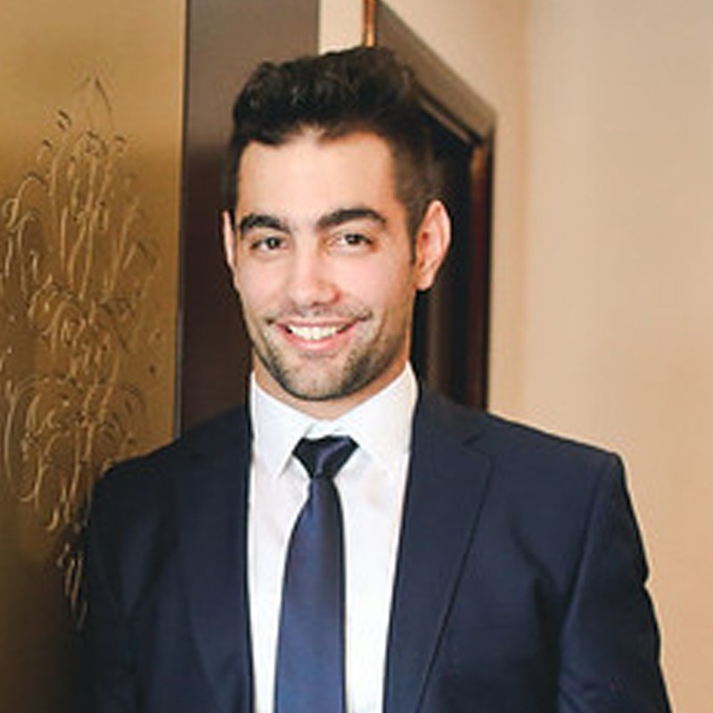

<!-- 

<table width="1000px">
<thead>
<tr>
    <th></th>
    <th></th>
</tr>
</thead>
<tbody>
<tr>
<!-- <td width="300"> -->
<td valign="top" align="left" width="30%" style="border-right: 1px solid black;">

## **Marko Bajlo**

**Embedded software engineer**  
Končar Electrical Engineering Institute Ltd.

---

### Contact:

Email: **<mbajlo00@fesb.hr>**  
Phone: **(+385)915226421**  
Website: **[linkedin](https://www.linkedin.com/in/marko-bajlo/)** [**github**](https://github.com/bajloml)

---

### Skills:
Technical: `C` `C++` `Assembly`  `Python` `git` `Gstreamer Python` `Linux` `yocto project` `TCP/UDP`  `VPN` `OPC` `mqqt`    
Management: `Kanban Methodology`   
Driving license: B  

---

</td>
<!-- <td width="600" vertical-align:top> -->
<td valign="top" align="left" width="70%" style="border-left: 1px solid black;">

## Work Experience

### Electrical Engineering Institude Ltd.
->_Zagreb, CRO_

**Embedded software engineer**
->_August 2021 to Present_

- Working on embedded systems in railway control. 
- Writing userspace applications and daemons for IPC  
  and network communication in Linux, 
  simple kernel modules and RTOS drivers on DSP. 
- Interfacing with different devices using various 
  communications protocols. 
- Working on Yocto based Linux distribution
- Maintenance and updates of older systems

### Stanić Automation Ltd.
->_Zagreb, CRO_

**Automation Engineer**
->_September 2016 to August 2021_
 
- Interfacing and programming controllers (PLCs) using Codesys 2, Codesys 3, Allen Bradley; robot (KUKA) using KRL and Human Machine Interface (HMI) programming using MicroInovation, Galileo, VisiWin, C# and Visual Basic to enable process safe product tracking and detect any kind of irregularities which need to be acknowledged and properly processed. 
- After Track and Trace's projects become mandatory in the Pharmaceutical Industry in the EU and US, I have been working with PLC software, specially developed to ensure aggregation and serialization productions run together with Track & Trace system by Systec, Uhlmann, OCS, Antares, SeaVision manufacturers. The software and products have been implemented and used in Bayer, Novo Nordisk, Pfizer, MSD, BMS, Novartis, Astra Zeneca, Jansen, and others.

### Ardor Ltd.
->_Zagreb, CRO_

**Engineer for safety automation and communication systems**
->_January 2016 to September 2016_

- Working as an engineer for safety automation and communication systems, interfacing sensors; controllers (PLCs); Human Machine Interfaces (HMI), and SCADA into scalable subsystems using PROFIBUS, PROFINET, MODBUS, HART, OPC communication protocols to set up the multilevel industrial network.
- During my professional time in Ardor, I was in charge of the functioning
of the Gas Detection System in Oil refinery Sisak and Pliva
pharmaceutical company.

## Education

### University of Split - Faculty of Electrical Engineering, Mechanical Engineering and Naval Architecture
->_September 2013 to June 2015_

**Master of Electrical Engineering (mag.ing.el)**, Split Croatia

**Field(s) of study:**
Automatization and Drives
A Frequency Converter With a High Frequency of the First Harmonic

### University of Split - Faculty of Electrical Engineering, Mechanical Engineering and Naval Architecture
->_September 2012 to June-2013_

**Additional ECTS credits program(necessary condition) to enroll in graduate study**, Split Croatia

### University of Rijeka - Faculty of Engineering
->_September 2008 to June-2011_

**Professional Bachelor of Electrical Engineering (bacc. ing. el.)y**, Rijeka Croatia

## Certificates

- Python programming Advanced - issued by Algebra
- [Armv8 Architecture: Exception Level](https://www.udemy.com/certificate/UC-f5f9b0ed-6610-486f-8357-c2fbdc0a13d5/)
- [Advanced C programming - Pointers](https://www.udemy.com/certificate/UC-ce01bc97-a6cd-42c5-9be6-ccb5c6242b21/)
- [Advanced C programming](https://www.udemy.com/certificate/UC-c27ee98b-3284-4b54-9ada-e30ed97e5b46/) 
- End to end machine learning with TensorFlow on GCP
[Credential ID 236W667XX3XB](https://www.coursera.org/account/accomplishments/verify/236W667XX3XB) 
- Version Control with Git
[Credential ID 8V99XY47WY4S](https://www.coursera.org/account/accomplishments/certificate/8V99XY47WY4S)
- TensorFlow: Advanced Techniques Specialization
[Credential ID RHWGMNR9P39N](https://www.coursera.org/account/accomplishments/specialization/certificate/RHWGMNR9P39N)
- DeepLearning.AI TensorFlow Developer Specialization
[Credential ID P9KYY4X2YA42](https://www.coursera.org/account/accomplishments/specialization/certificate/P9KYY4X2YA42)
- Deep Learning Specialization
[Credential ID 4EETY5AZLDUQ](https://www.coursera.org/account/accomplishments/specialization/certificate/4EETY5AZLDUQ)
- Premium Campaign April 2016
-Issuing authority: Siemens

## Hobbies and Interests
Continuous learning and education in embedded linux, security, IoT, computer, vision, robotics.

</td>
</tr>
</tbody>
</table>